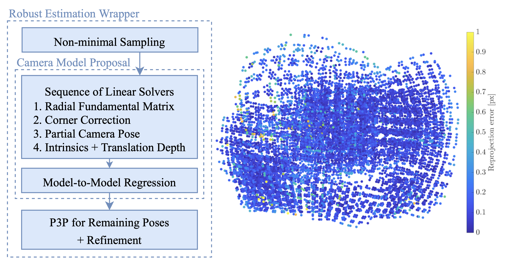
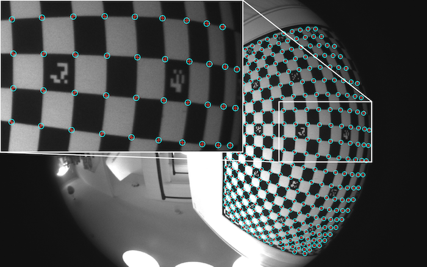
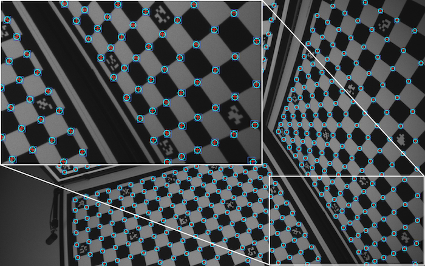
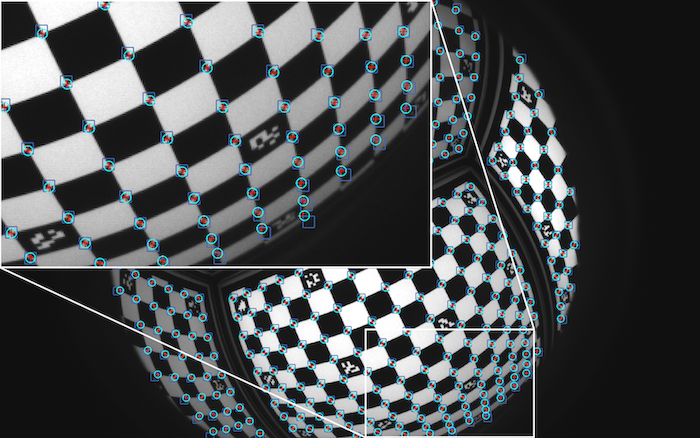

# BabelCalib: A Universal Approach to Calibrating Central Cameras

<div align="center">

[](https://arxiv.org/abs/2109.09704)
[](https://drive.google.com/drive/folders/1MidyBPgK7GVqWA0qkiQq6NvhcuWQAHaZ)
[](https://openaccess.thecvf.com/content/ICCV2021/html/Lochman_BabelCalib_A_Universal_Approach_to_Calibrating_Central_Cameras_ICCV_2021_paper.html)
[](https://ylochman.github.io/babelcalib/poster.pdf)
[](https://www.youtube.com/watch?v=7cClH_mPfHo)

This repository contains the MATLAB implementation of the BabelCalib calibration framework.


    
<b>Method overview and result.</b> (left) BabelCalib pipeline: the camera model proposal step ensures a good initialization (right) example result showing residuals of reprojected corners of test images.
    
<br/>




    
<b>Projection of calibration target from estimated calibration.</b> Detected corners are red crosses, target projected using initial calibration are blue squares and using the final calibration are cyan circles.

</div>

## Description
BabelCalib is a calibration framework that can estimate camera models for all types of central projection cameras. Calibration is robust and fully automatic. BabelCalib provides models for pinhole cameras with additive distortion as well as omni-directional cameras and catadioptric rigs. The supported camera models are listed under the [solvers](./core/solvers) directory. BabelCalib supports calibration targets made of a collection of calibration boards, i.e., multiple planar targets. The method is agnostic to the pattern type on the calibration boards. It is robust to inaccurately localized corners, outlying detections and occluded targets. 

## Table of Contents
- [Installation](#installation)
- [Calibration](#calibration)
    - [Evaluation](#evaluation)
    - [Type Definitions](#defs)
- [Examples and wrappers](#examples)
    - [Calibrating with 2D<->3D correspondences](#calib-csponds)
    - [Calibrating with Deltille](#calib-deltille)
- [Citation](#citation)
- [License](#license)

---
<a name="installation"/>

## Installation
You need to clone the repository. The required library [Visual Geometry Toolkit](https://github.com/prittjam/vgtk) is added as a submodule. Please clone the repository with submodules: 
```bash
git clone --recurse-submodules https://github.com/ylochman/babelcalib
```
If you already cloned the project without submodules, you can run
```bash
git submodule update --init --recursive 
```

<a name="calibration"/>

## Calibration
Calibration is performed by the function [`calibrate.m`](./core/calibrate.m).  The user provides the 2D<->3D correspondence of the corner detections in the captured images as well as the coordinates of the calibration board fiducials and the absolute poses of the calibration boards. Any calibration board of the target may be partially or fully occluded in a calibration image. The camera model is returned as well as diagnostics about the calibration. 

```matlab
function [model, res, corners, boards] = calibrate(corners, boards, imgsize, varargin)
```
Parameters:
* `corners` : type [corners](#corners)
* `boards` : type [boards](#boards)
* `imgsize` : 1x2 array specifying the height and width of the images; all images in a capture are assumed to have the same dimensions.
* `varargin` : [optional arguments](#cfg)

Returns
* `model` : type [model](#model)
* `res` : type [res](#res)
* `corners` : type [corners](#corners)
* `boards` : type [boards](#boards)


<a name="evaluation"/>

## Evaluation
BabelCalib adopts the train-test set methodology for fitting and evaluation. The training set contains the images used for calibration, and the test set contains held-out images for evaluation. Evaluating a model on test-set images demonstrates how well a calibration generalizes to unseen imagery. During testing, the intriniscs are kept fixed and only the poses of the camera are regressed. The RMS re-projection error is used to assess calibration quality. The poses are estimated by [`get_poses.m`](./core/get_poses.m):
```matlab
function [model, res, corners, boards] = get_poses(intrinsics, corners, boards, imgsize, varargin)
```    
Parameters:
* `intrinsics` : type [model](#model)
* `corners` : type [corners](#corners)
* `boards` : type [boards](#boards)
* `imgsize` : 1x2 array
              specifies the height and width of the images; all the images are assumed to have the same dimensions
* `varargin` : [optional arguments](#cfg)

Returns
* `model` : type [model](#model)
* `res` : type [res](#res)
* `corners` : type [corners](#corners)
* `boards` : type [boards](#boards)


<a name="defs"/>

## Type Defintions

<a name="corners"/>

#### `corners` : 1xN struct array 
Contains the set of 2D<->3D correspondences of the calibration board fiducials to the detected corners in each image. Here, we let `N` be the number of images; Kn be the number of detected corners in the n-th image, where (n=1,...,N); and `B` be the number of planar calibration boards.

| field         | data type     | description  |
|:-------------:|:---------------------:|:-------------|
| `x`      | 2xKn array | 2D coordinates specifying the detected corners |
| `cspond` | 2xKn array | correspondences, where each column is a correspondence and the first row contains the indices to points and the second row contains indices to calibration board fiducials |

<a name="boards"/>

#### `boards` : 1xB struct array
Contains the set of absolute poses for each of the `B` calibration boards of the target, where (b=1,...,B) indexes the calibration boards. Also specifies the coordinates of the fiducials on each of the calibration boards. 

| field         | data type     | description  |
|:-------------:|:---------------------:|:-------------|
| `Rt` | 3x4 array | absolute orientation of each pose is encoded in the 3x4 pose matrix |
| `X`  | 2xKb array | 2D coordinates of the fiducials on board b of the target. The coordinates are specified with respect to the 2D coordinate system attached to each board |

<a name="model"/>

#### `model` : struct
Contains the intrinsics and extrinsics of the regressed camera model. The number of parameters of the back-projection or projection model, denoted `C`, depends on the chosen camera model and model complexity. 

| field         | data type     | description  |
|:-------------:|:---------------------:|:-------------|
|  `proj_model` | str | name of the target projection model
| `proj_params` | 1xC array | parameters of the projection/back-projection function |
| `K`  | 3x3 array | camera calibration matrix (relating to `A` in the paper: `K = inv(A)`) |
| `Rt` | 3x4xN array | camera poses stacked along the array depth |

<a name="res"/>

#### `res` : struct
Contains the information about the residuals, loss and initialization (minimal solution). Here, we let `K` be the total number of corners in all the images.

| field         | data type     | description  |
|:-------------:|:---------------------:|:-------------|
|          `loss`| double | loss value
|            `ir`| double | inlier ratio
|    `reprojerrs`| 1xK array | reprojection errors
|           `rms`| double | root mean square reprojection error
|          `wrms`| double | root mean square weighted reprojection error (Huber weights)
|          `info`| type [info](#info) | 

<a name="info"/>

#### `info` : struct
Contains additional information about the residuals, loss and initialization (minimal solution).
| field         | data type     | description  |
|:-------------:|:---------------------:|:-------------|
|           `dx` | 2xK array            | re-projection difference vectors: `dx` = `x` - `x_hat`
|            `w` | 1xK array            | Huber weights on the norms of `dx`
|     `residual` | 2xK array            | residuals: `residual` = `w` .* `dx`
|           `cs` | 1xK array (boolean)  | consensus set indicators (`1` if inlier, `0` otherwise)
|    `min_model` | type [model](#model) | model corresponding to the minimal solution
|      `min_res` | type [res](#res)     | residual info corresponding to the minimal solution

<a name="cfg"/>

#### `cfg`
`cfg` contains the optional configurations. Default values for the optional parameters are loaded from [`parse_cfg.m`](./core/parse_cfg.m). These values can be changed by using the `varargin` parameter. Parameters values passed in by `varargin` take precedence. The varargin format is `'param_1', value_1, 'param_2', value_2, ...`. The parameter descriptions are grouped by which component of BabelCalib they change.

Solver configurations:
* `final_model` - the selected camera model (default: 'kb')
* `final_complexity` - a degree of the polynomial if the final model is polynomial, otherwise ignored (default: 4)

Sampler configurations:
* `min_trial_count` - minimum number of iterations (default: 20)
* `max_trial_count` - maximum number of iterations (default: 50)
* `max_num_retries` - maximum number of sampling tries in the case of a solver failure (default: 50)
* `confidence` - confidence rate (default: 0.995)
* `sample_size` - the number of 3D<->2D correspondences that are sampled for each RANSAC iteration (default: 14)

RANSAC configurations:
* `display` - toggles the display of verbose output of intermediate steps (default: true)
* `display_freq` - frequency of output during the iterations of robust sampling.   (default: 1)
* `irT` - minimum inlier ratio to perform refinement (default: 0)

Refinement configurations:
* `reprojT` - reprojection error threshold (default: 1.5)
* `max_iter` - maximum number of iterations on the refinement (default: 50)


<a name="examples"/>

## Examples and wrappers

<a name="calib-csponds"/>

### 2D<->3D correspondences
BabelCalib provides a convenience wrapper (see [`calib_run_plane.m`](./calib_run_plane.m) and [`calib_run_cube.m`](./calib_run_cube.m)) for running the calibration  [`calibrate.m`](./core/calibrate.m)  with a training set and evaluating [`get_poses.m`](./core/get_poses.m) with a test set.

<a name="calib-deltille"/>

### Deltille
The [Deltille detector](https://github.com/facebookarchive/deltille) is a robust deltille and checkerboard detector. It comes with detector library, example detector code, and MATLAB bindings. BabelCalib provides functions for calibration and evaluation using the Deltille software's outputs. Calibration from Deltille detections requires format conversion which is peformed by [`import_ODT.m`](./core/feature/import_ODT.m). A complete example of using `calibrate` and `get_poses` with `import_ODT` is provided in  [`calib_run_plane_deltille.m`](./calib_run_plane_deltille.m) and [`calib_run_cube_deltille.m`](./calib_run_cube_deltille.m).

<a name="citation"/>

## Citation
If you find this work useful in your research, please consider citing:

```bibtex
@InProceedings{Lochman-ICCV21,
    title     = {BabelCalib: A Universal Approach to Calibrating Central Cameras},
    author    = {Lochman, Yaroslava and Liepieshov, Kostiantyn and Chen, Jianhui and Perdoch, Michal and Zach, Christopher and Pritts, James},
    booktitle = {Proceedings of the IEEE/CVF International Conference on Computer Vision (ICCV)},
    year      = {2021},
    pages     = {15253-15262}
}
```

<a name="license"/>

## License
The software is licensed under the MIT license. Please see [`LICENSE`](LICENSE) for details.
 
