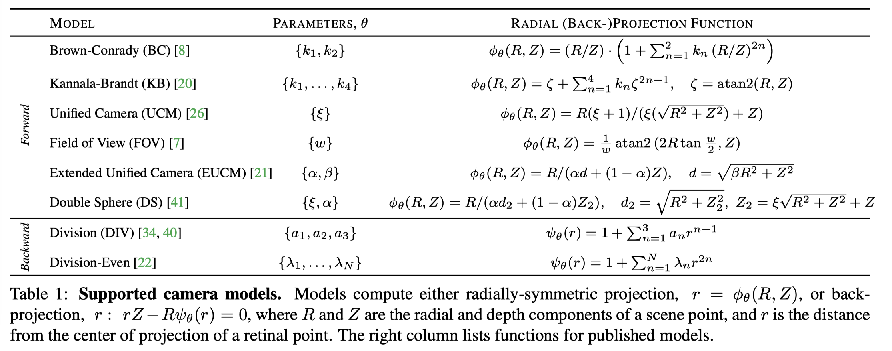

## Supported models
The supported models are shown in this table from the paper:

### Model-to-model regression functions
All the camera model-to-model regression functions are located under [`m2m_fit`](./m2m_fit).

* Brown-Conrady (BC) - [`fit_bc_to_div.m`](./m2m_fit/fit_bc_to_div.m)
* Kannala-Brandt (KB) - [`fit_kb_to_div.m`](./m2m_fit/fit_kb_to_div.m)
* Unified Camera (UCM) - [`fit_ucm_to_div.m`](./m2m_fit/fit_ucm_to_div.m)
* Field of View (FOV) - [`fit_fov_to_div.m`](./m2m_fit/fit_fov_to_div.m)
* Extended Unified Camera (EUCM) - [`fit_eucm_to_div.m`](./m2m_fit/fit_eucm_to_div.m)
* Double Sphere (DS) - [`fit_ds_to_div.m`](./m2m_fit/fit_ds_to_div.m)
* Division (DIV) - [`fit_sc_to_div.m`](./m2m_fit/fit_sc_to_div.m)
* Division-Even - [`fit_div_to_div.m`](./m2m_fit/fit_div_to_div.m)
